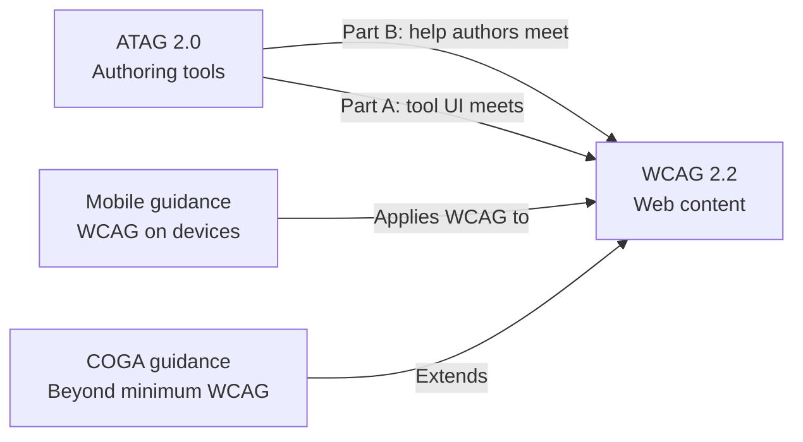

# Accessibility Standards Router

## WCAG Access project

This is the **project copy** for the WCAG Access repo (Next.js TSX analyzer). Always read child skill `project-context.md` files when working in this codebase.

Project skills live in `.cursor/skills/`. General (personal) copies live in `~/.cursor/skills/`.

See also: [AGENTS.md](../../AGENTS.md) at repo root.

## Standards overview

W3C WAI accessibility is a family of standards. They work together:



| Standard | Skill | Primary question |
|----------|-------|------------------|
| WCAG 2.2 | `wcag-22` | Is the web content accessible? |
| ATAG 2.0 | `atag-20` | Is the authoring tool accessible and does it help authors? |
| Mobile | `mobile-a11y` | Does it work on touch devices and small screens? |
| Cognitive | `cognitive-a11y` | Is it understandable and low cognitive load? |

## Task routing (WCAG Access)

| Task | Read first | Project context file |
|------|------------|---------------------|
| New analyzer rule or WCAG guide | `wcag-22` | `wcag-22/project-context.md` |
| Analyzer UI, editor, auth forms | `atag-20` Part A + `wcag-22` | `atag-20/project-context.md` |
| Finding messages, fix suggestions, guides | `atag-20` Part B + `cognitive-a11y` | `cognitive-a11y/project-context.md` |
| Responsive layout, touch targets | `mobile-a11y` + `wcag-22` | `mobile-a11y/project-context.md` |
| Full app accessibility review | All four child skills | All `project-context.md` files |

## Child skills (project)

| Skill | SKILL.md | Reference files | Project context |
|-------|----------|-----------------|-----------------|
| `wcag-22` | `.cursor/skills/wcag-22/SKILL.md` | `criteria-reference.md`, `react-patterns.md` | `project-context.md` |
| `atag-20` | `.cursor/skills/atag-20/SKILL.md` | `success-criteria.md` | `project-context.md` |
| `mobile-a11y` | `.cursor/skills/mobile-a11y/SKILL.md` | `wcag2mobile-checklist.md` | `project-context.md` |
| `cognitive-a11y` | `.cursor/skills/cognitive-a11y/SKILL.md` | `coga-patterns.md` | `project-context.md` |

## Pre-development checklist

Run before implementing any new WCAG Access feature:

```
Pre-development a11y checklist:
- [ ] Identified target WCAG conformance level (default: AA)
- [ ] Determined if change affects authored content (WCAG) or tool UI (ATAG Part A)
- [ ] Determined if change affects author guidance/output (ATAG Part B)
- [ ] Checked mobile impact: touch targets, reflow, no hover-only behavior
- [ ] Planned plain-language copy for errors, findings, and new UI text
- [ ] Listed WCAG success criteria the feature should meet or help meet
- [ ] Planned keyboard and screen reader test for interactive changes
- [ ] Confirmed existing axe e2e tests still cover affected pages
- [ ] Read relevant project-context.md for integration paths
```

## Conformance level guidance

| Context | Recommended level |
|---------|-------------------|
| Public web content | WCAG 2.2 AA |
| WCAG Access tool UI (ATAG Part A) | ATAG 2.0 AA |
| WCAG Access author support (ATAG Part B) | ATAG 2.0 AA |
| Enhanced cognitive usability | WCAG AA + COGA supplemental patterns |

## Essential W3C links

- WCAG 2.2: https://www.w3.org/TR/WCAG22/
- ATAG 2.0: https://www.w3.org/TR/ATAG20/
- Mobile: https://www.w3.org/WAI/standards-guidelines/mobile/
- Cognitive: https://www.w3.org/WAI/cognitive/
- Essential Components: https://www.w3.org/WAI/fundamentals/components/

## Future standards (out of scope for now)

- **WCAG 3.0:** Early draft; not for production conformance claims.
- **WAI-Adapt:** Personalization for cognitive accessibility; monitor but do not implement against draft specs.
